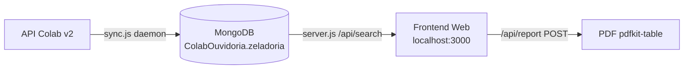

# 🗺️ MOC — Eladoria API

> **Map of Content (MOC)** principal do projeto **Eladoria API**.  
> Este cofre documenta toda a arquitetura, banco de dados, endpoints, scripts e regras de negócio do sistema de integração com a API Colab para gestão de manifestações de **Zeladoria Urbana**.

---

## 📌 Metadados do Projeto

| Item | Valor |
|------|-------|
| **Nome do Projeto** | Eladoria API |
| **Finalidade** | Sincronização e análise de manifestações de Zeladoria via API Colab |
| **Banco de Dados** | MongoDB — `ColabOuvidoria` |
| **Coleção Principal** | `zeladoria` |
| **API Externa** | Colab App `v2` |
| **Servidor Local** | `http://localhost:3000` |
| **Plataforma** | Node.js + Express |
| **Última Atualização** | Abril 2026 |

---

## 🗂️ Índice do Cofre

### 🏗️ [[01 - Arquitetura do Sistema]]
Visão geral da arquitetura, fluxo de dados e stack tecnológica.

### 📦 [[02 - Schema do Banco de Dados]]
Mapeamento completo dos campos da coleção `zeladoria` no MongoDB.

### 🔌 [[03 - Endpoints da API REST]]
Todas as rotas do servidor Express (`server.js`).

### 🔄 [[04 - Sincronização com Colab API]]
Detalhamento do daemon `sync.js` e sua lógica de paginação temporal.

### 🗂️ [[05 - Categorias e Temas]]
Mapa completo de `category_id` → tema legível (`CATEGORY_MAP`).

### 🏢 [[06 - Secretarias e Branches]]
Mapa completo de `branch.id` → Secretaria (`BRANCH_TO_SECRETARIA`).

### 📊 [[07 - Status e Regras de Negócio]]
Lógica de resolução de status canônico, simplificado e demanda.

### 📜 [[08 - Scripts de Auditoria]]
Inventário de todos os scripts utilitários (`.js`) e suas funções.

### 🌐 [[09 - Frontend Web]]
Documentação da interface pública (`public/index.html`, `app.js`).

### 📄 [[10 - Geração de Relatórios PDF]]
Fluxo de geração de PDF via `pdfkit-table`.

### ⚙️ [[11 - Variáveis de Ambiente]]
Todas as variáveis `.env` e seus valores padrão.

### 🗄️ [[12 - Bancos de Dados Disponíveis]]
Inventário dos bancos MongoDB locais.

---

## 🔗 Links Rápidos

- [[02 - Schema do Banco de Dados#Campos da API Colab (Origem)]]
- [[04 - Sincronização com Colab API#Janela Temporal do Daemon]]
- [[05 - Categorias e Temas#Tabela Completa de Categorias]]
- [[06 - Secretarias e Branches#Secretaria de Obras]]

---

## 🧠 Notas de Arquiteto

> O sistema opera como um **daemon de sincronização** que consome a API Colab em janelas de tempo configuráveis (padrão: blocos de 3 horas), gravando todos os registros no MongoDB local com enriquecimento de campos canônicos (Cérebro X-3). O servidor REST expõe os dados para um frontend leve de busca e geração de PDF.

