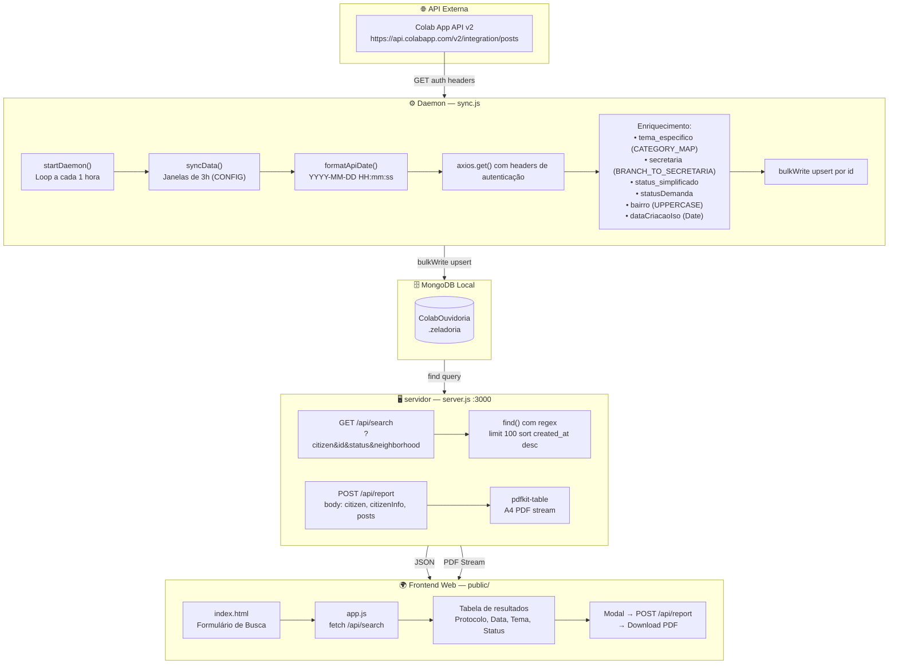

# 🏗️ Arquitetura do Sistema — Eladoria API

> [[00 - MOC - Eladoria API|← Voltar ao MOC]]

---

## 📐 Visão Geral

O **Eladoria API** é um sistema de backend Node.js composto por:

1. **Daemon de Sincronização** (`sync.js`) — consome a API Colab em intervalos regulares e persiste os dados no MongoDB local com enriquecimento de campos.
2. **Servidor REST** (`server.js`) — expõe endpoints HTTP para busca e geração de relatórios PDF.
3. **Frontend SPA leve** (`public/`) — interface web de busca e análise de manifestações.

---

## 🧩 Stack Tecnológica

| Camada | Tecnologia | Versão |
|--------|-----------|--------|
| Runtime | Node.js | LTS |
| Framework HTTP | Express | ^5.2.1 |
| Banco de Dados | MongoDB | Driver ^7.1.1 |
| HTTP Client | Axios | ^1.14.0 |
| Geração de PDF | pdfkit + pdfkit-table | ^0.18.0 / ^0.1.99 |
| Variáveis de Ambiente | dotenv | ^17.3.1 |
| CORS | cors | ^2.8.6 |
| Serialização de Params | qs | ^6.15.0 |

---

## 🗺️ Fluxo de Dados Completo



---

## 📁 Estrutura de Arquivos

```
eladoriaapi/
├── .env                        # Variáveis de ambiente
├── .gitignore
├── package.json                # Dependências e metadados
├── server.js                   # ⭐ Servidor REST Express (porta 3000)
├── sync.js                     # ⭐ Daemon de sincronização com Colab API
├── modelo.json                 # Exemplo de documento MongoDB (4 registros)
├── schema_discovery.json       # Schema da API Colab descoberto
├── api_full_report.json        # Catálogo completo de categorias e branches
├── dbs.json                    # Lista de bancos disponíveis no MongoDB local
│
├── public/                     # Frontend estático
│   ├── index.html
│   ├── app.js
│   └── style.css
│
└── scripts/                    # Scripts utilitários de auditoria e exportação
    ├── analyze_schema.js
    ├── audit_ranking.js
    ├── audit_treatment.js
    ├── check_email.js
    ├── deep_research.js
    ├── discover_api.js
    ├── discover_v2.js
    ├── enrich_data.js
    ├── explore_full_api.js
    ├── export_marco_json.js
    ├── fetch_api_ids.js
    ├── fetch_samples.js
    ├── find_one_eliza.js
    ├── generate_report.js
    ├── investigate_sem_secretaria.js
    ├── list_branches_mongo.js
    ├── list_categories.js
    ├── list_secretarias_temp.js
    ├── mapa_dados.js
    ├── marco2026.js
    ├── nitro_reprocess.js
    ├── report_atendimento_marco.js
    ├── reprocess_secretaria.js
    ├── reprocess_status.js
    ├── search_deep_match.js
    ├── search_last_two_weeks.js
    ├── search_manifestacao.js
    ├── search_manifestacao_final.js
    └── verify_sync.js
```

---

## 🔐 Autenticação com Colab API

A API Colab exige **3 headers obrigatórios** em todas as requisições:

| Header | Variável de Ambiente |
|--------|---------------------|
| `x-colab-application-id` | `COLAB_APP_ID` |
| `x-colab-rest-api-key` | `COLAB_API_KEY` |
| `x-colab-admin-user-auth-ticket` | `COLAB_AUTH_TICKET` |

---

## ⚡ Configurações do Daemon

| Parâmetro | Valor Padrão | Variável `.env` |
|-----------|-------------|-----------------|
| Data Inicial | `2025-08-15T00:00:00Z` | `DATA_INICIAL` |
| Intervalo de Janela | 3 horas | `INTERVALO_HORAS` |
| Delay entre requisições | 4 segundos (hardcoded) | — |
| Ciclo do Daemon | 1 hora (3.600.000 ms) | — |
| Janela do Daemon (modo auto) | Últimas 48 horas | — |
| Rate Limit (429) | +10s extra de espera | — |

---

## 🔗 Ver Também

- [[02 - Schema do Banco de Dados]]
- [[03 - Endpoints da API REST]]
- [[04 - Sincronização com Colab API]]
- [[11 - Variáveis de Ambiente]]
