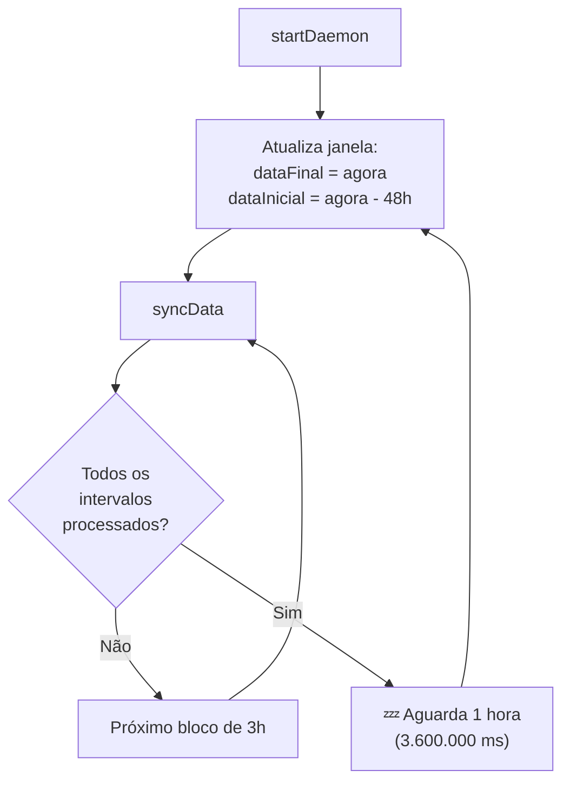
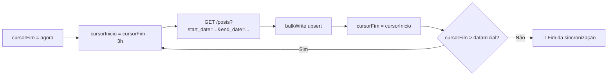

# 🔄 Sincronização com Colab API — Eladoria API

> [[00 - MOC - Eladoria API|← Voltar ao MOC]]  
> Arquivo fonte: `sync.js`

---

## 🎯 Objetivo

O `sync.js` é o **coração do sistema**. Ele opera como um **daemon** (processo contínuo) que consome a API Colab em janelas de tempo configuráveis, enriquece os dados com campos canônicos e os persiste no MongoDB local via `bulkWrite` com upsert.

---

## ⚙️ Configuração (`CONFIG`)

```js
const CONFIG = {
    dataInicial:     new Date(process.env.DATA_INICIAL || '2025-08-15T00:00:00Z'),
    dataFinal:       new Date(),  // agora
    intervaloHoras:  parseInt(process.env.INTERVALO_HORAS || '12'), // padrão: 3 no .env atual
    mongoUri:        process.env.MONGO_URI     || 'mongodb://127.0.0.1:27017',
    dbName:          process.env.DB_NAME       || 'ColabOuvidoria',
    collectionName:  process.env.COLLECTION_NAME || 'posts',
    api: {
        baseUrl: process.env.API_BASE_URL || 'https://api.colabapp.com/v2/integration/posts',
        headers: {
            'x-colab-application-id':       process.env.COLAB_APP_ID,
            'x-colab-rest-api-key':         process.env.COLAB_API_KEY,
            'x-colab-admin-user-auth-ticket': process.env.COLAB_AUTH_TICKET
        }
    },
    dominio:  process.env.DOMINIO || 'zeladoria',
    delayMs:  4000  // 4 segundos obrigatórios entre requisições
};
```

### Valores Ativos no `.env`

| Variável | Valor Atual |
|----------|------------|
| `DATA_INICIAL` | `2026-04-07T00:00:00Z` |
| `INTERVALO_HORAS` | `3` horas |
| `COLLECTION_NAME` | `zeladoria` |
| `DOMINIO` | `zeladoria` |

---

## 🔁 Modo Daemon — `startDaemon()`



**Comportamento do Daemon:**
- Reinicia a cada **1 hora**
- A cada ciclo, reprocessa as últimas **48 horas** de dados
- Garante que dados recentes sejam sempre atualizados

---

## 📡 Lógica de Paginação Temporal — `syncData()`

A API Colab **não possui paginação por offset**. A estratégia é fatiar o tempo em blocos:



**Percurso:** Do passado ao presente, em blocos de **3 horas**, com **4 segundos** de delay entre cada requisição.

---

## ✨ Enriquecimento de Dados

Para cada item recebido da API, o daemon adiciona:

```js
const doc = {
    ...item,                                              // todos os campos originais
    dominio:              CONFIG.dominio,                  // "zeladoria"
    tema_especifico:      CATEGORY_MAP[item.category_id] || "Outros / Zeladoria",
    assunto:              tema,                            // espelho de tema_especifico
    secretaria:           resolveSecretaria(item),         // via branch.id ou branch.name
    status_simplificado:  resolveStatusSimplificado(item.status),
    statusDemanda:        resolveStatusDemanda(item.status),
    bairro:               (item.neighborhood || 'NÃO INFORMADO').toUpperCase(),
    dataCriacaoIso:       item.created_at ? new Date(item.created_at) : null,
    last_sync_at:         new Date()
};
```

---

## 💾 Gravação no MongoDB — `bulkWrite`

```js
// Estratégia: upsert por id (ID do protocolo Colab)
collection.bulkWrite(items.map(item => ({
    replaceOne: {
        filter: { id: item.id },
        replacement: doc,
        upsert: true     // Insere se não existir, atualiza se existir
    }
})));
```

> **⚠️ Importante:** O `replaceOne` substitui o documento **inteiro**. Não há merge parcial.

---

## 🛡️ Tratamento de Erros

| Situação | Comportamento |
|----------|--------------|
| `HTTP 429` (Rate Limit) | Aguarda +10 segundos extras antes de continuar |
| `HTTP 401/403` (Auth) | **Encerra o processo imediatamente** |
| Timeout (>30s) | Loga erro e avança para próximo intervalo |
| Erro não tratado | Capturado por `uncaughtException` (log, não finaliza) |

---

## 📅 Formato de Data da API

A API Colab exige datas no formato específico:
```
YYYY-MM-DD HH:mm:ss.0000
```

Função de formatação:
```js
function formatApiDate(date) {
    return date.toISOString()
        .replace('T', ' ')
        .replace('Z', '')
        .padEnd(24, '0');
    // Exemplo: "2026-03-31 12:33:22.0000000000"
}
```

---

## 🔗 Ver Também

- [[02 - Schema do Banco de Dados]] — campos enriquecidos
- [[05 - Categorias e Temas]] — `CATEGORY_MAP`
- [[06 - Secretarias e Branches]] — `BRANCH_TO_SECRETARIA`
- [[07 - Status e Regras de Negócio]] — funções resolve
- [[11 - Variáveis de Ambiente]] — configuração do daemon
