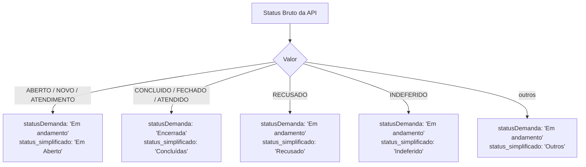

# 📊 Status e Regras de Negócio — Eladoria API

> [[00 - MOC - Eladoria API|← Voltar ao MOC]]  
> Fonte: `sync.js` — funções `resolveStatus*`

---

## 📌 Visão Geral

O campo `status` recebido da API Colab possui valores **brutos** (ex: `ABERTO`, `CONCLUIDO`, `NOVO`). O daemon converte esses valores em **3 representações canônicas** armazenadas no MongoDB.

---

## 🔄 Mapa de Status

### Status Brutos da API (`status`)

Os seguintes valores foram identificados na API Colab:

| Valor Bruto | Significado |
|------------|------------|
| `ABERTO` | Manifestação aberta, ainda não em atendimento |
| `NOVO` | Manifestação recém-criada |
| `ATENDIMENTO` | Manifestação em processo de atendimento |
| `CONCLUIDO` | Manifestação concluída com êxito |
| `FECHADO` | Manifestação encerrada |
| `ATENDIDO` | Manifestação atendida |
| `RECUSADO` | Manifestação recusada |
| `INDEFERIDO` | Manifestação indeferida |

---

## 🔵 Campo: `statusDemanda` — Binário

**Função:** `resolveStatusDemanda(status)`

```js
function resolveStatusDemanda(status) {
    const s = String(status).toUpperCase();
    if (["ABERTO", "ATENDIMENTO", "NOVO"].includes(s)) return "Em andamento";
    if (["CONCLUIDO", "FECHADO", "ATENDIDO"].includes(s))  return "Encerrada";
    return "Em andamento";  // fallback
}
```

| Status Bruto | `statusDemanda` |
|-------------|----------------|
| `ABERTO` | ✅ `"Em andamento"` |
| `NOVO` | ✅ `"Em andamento"` |
| `ATENDIMENTO` | ✅ `"Em andamento"` |
| `CONCLUIDO` | 🔒 `"Encerrada"` |
| `FECHADO` | 🔒 `"Encerrada"` |
| `ATENDIDO` | 🔒 `"Encerrada"` |
| `RECUSADO` | ✅ `"Em andamento"` *(fallback)* |
| `INDEFERIDO` | ✅ `"Em andamento"` *(fallback)* |

> **Uso:** Cálculo de taxa de resolução em agregações MongoDB.

---

## 🟡 Campo: `status_simplificado` — Multi-valor

**Função:** `resolveStatusSimplificado(status)`

```js
function resolveStatusSimplificado(status) {
    const s = String(status).toUpperCase();
    if (["ABERTO", "ATENDIMENTO", "NOVO"].includes(s)) return "Em Aberto";
    if (["CONCLUIDO", "FECHADO", "ATENDIDO"].includes(s))  return "Concluídas";
    if (s === "RECUSADO")   return "Recusado";
    if (s === "INDEFERIDO") return "Indeferido";
    return "Outros";
}
```

| Status Bruto | `status_simplificado` |
|-------------|----------------------|
| `ABERTO` | 🟡 `"Em Aberto"` |
| `NOVO` | 🟡 `"Em Aberto"` |
| `ATENDIMENTO` | 🟡 `"Em Aberto"` |
| `CONCLUIDO` | 🟢 `"Concluídas"` |
| `FECHADO` | 🟢 `"Concluídas"` |
| `ATENDIDO` | 🟢 `"Concluídas"` |
| `RECUSADO` | 🔴 `"Recusado"` |
| `INDEFERIDO` | 🟠 `"Indeferido"` |
| *(outros)* | ⚫ `"Outros"` |

> **Uso:** KPIs de dashboard e gráficos de análise.

---

## 🌐 Campo: `status` — Filtro no Frontend

O frontend (`index.html`) expõe os seguintes valores de filtro:

```html
<option value="">Todos</option>
<option value="ABERTO">Aberto</option>
<option value="ATENDIMENTO">Em Atendimento</option>
<option value="FECHADO">Fechado</option>
<option value="INDEFERIDO">Indeferido</option>
<option value="RECUSADO">Recusado</option>
```

---

## 📐 Diagrama de Decisão



---

## 📊 Uso em Agregações MongoDB

### Cálculo de Taxa de Resolução
```js
// Usa statusDemanda para calcular taxa de resolução por secretaria
{
  $group: {
    _id: '$secretaria',
    total: { $sum: 1 },
    concluidos: {
      $sum: { $cond: [{ $eq: ['$statusDemanda', 'Encerrada'] }, 1, 0] }
    }
  }
}
```

### Filtro de KPI — Demandas em Aberto
```js
{ status_simplificado: 'Em Aberto' }
```

---

## 🔗 Ver Também

- [[02 - Schema do Banco de Dados]] — campos `status`, `statusDemanda`, `status_simplificado`
- [[04 - Sincronização com Colab API]] — onde as funções são aplicadas
- [[08 - Scripts de Auditoria]] — scripts que usam essas regras
