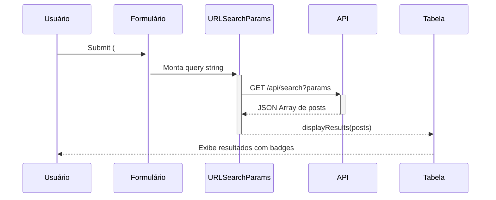
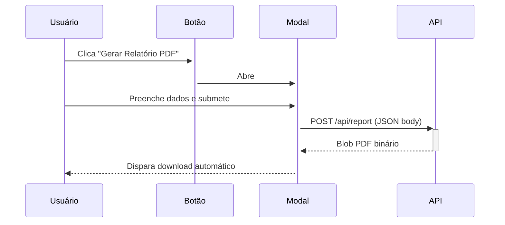

# 🌐 Frontend Web — Eladoria API

> [[00 - MOC - Eladoria API|← Voltar ao MOC]]  
> Localização: `public/` | URL: `http://localhost:3000`

---

## 📌 Visão Geral

O frontend é uma **SPA leve** (Single Page Application sem framework) servida pelo Express como arquivos estáticos. Permite buscar manifestações e gerar relatórios PDF diretamente do banco de dados.

```
public/
├── index.html   (112 linhas) - Estrutura e formulários
├── app.js       (111 linhas) - Lógica de busca e PDF
└── style.css    (5.124 bytes) - Estilos Glassmorphism
```

---

## 🖥️ Interface — `index.html`

### Título e Metadados
```html
<title>Zeladoria Analytics - Busca & Análise</title>
<link href="https://fonts.googleapis.com/css2?family=Inter:wght@300;400;600;700" rel="stylesheet">
```

**Font:** Inter (Google Fonts) — pesos 300, 400, 600, 700

### Componentes da Interface

| Componente | Elemento | ID/Classe |
|-----------|---------|----------|
| Decoração de fundo | `<div>` | `.background-decor` `.blob.blob-1` `.blob.blob-2` |
| Cabeçalho | `<header>` | Título: "🔍 Zeladoria Analytics" |
| Formulário de busca | `<section>` | `.search-section.glass` |
| Seção de resultados | `<section>` | `#results-section` (hidden por padrão) |
| Tabela de resultados | `<table>` | `#results-table` |
| Modal de dados para PDF | `<div>` | `#report-modal` |

### Formulário de Busca (`#search-form`)

| Campo | Tipo | ID | Placeholder |
|-------|------|----|-------------|
| Nome do Cidadão | `text` | `#citizen` | "Ex: Luciandro Pereira" |
| Protocolo / ID | `number` | `#protocol` | "000000" |
| Bairro | `text` | `#neighborhood` | "Ex: Jardim Primavera" |
| Status | `select` | `#status` | — |

**Opções do select Status:**
- Todos (vazio)
- Aberto (`ABERTO`)
- Em Atendimento (`ATENDIMENTO`)
- Fechado (`FECHADO`)
- Indeferido (`INDEFERIDO`)
- Recusado (`RECUSADO`)

### Tabela de Resultados

| Coluna | Campo do MongoDB |
|--------|----------------|
| Protocolo | `post.id` → `#${post.id}` |
| Data | `post.created_at` → `toLocaleDateString('pt-BR')` |
| Tema | `post.tema_especifico` (badge) |
| Cidadão | `post.citizen` |
| Bairro | `post.neighborhood` |
| Status | `post.status` (badge colorido por classe CSS) |

### Modal de Dados do Cidadão (`#report-modal`)

| Campo | ID | Valor Padrão |
|-------|----|-------------|
| Data de Nascimento | `#rep-nascimento` | `27/12/1985` |
| Celular | `#rep-celular` | `+5521989200123` |
| E-mail | `#rep-email` | `leone.marketin2024@gmail.com` |

---

## ⚡ Lógica — `app.js`

### Fluxo de Busca



### Fluxo de Geração de PDF



### Variável de Estado Global

```js
let currentPosts = [];   // Armazena os resultados atuais para uso no PDF
```

### Eventos Registrados

| Evento | Elemento | Ação |
|--------|---------|------|
| `submit` | `#search-form` | Chama `/api/search` e renderiza tabela |
| `click` | `#btn-report` | Abre modal de dados do cidadão |
| `click` | `#btn-cancel` | Fecha modal |
| `click` | `#btn-print` | `window.print()` |
| `submit` | `#report-form` | Chama `/api/report` e faz download |

### Nome do Arquivo PDF Gerado

```js
`Relatorio_Zeladoria_${citizenName.replace(/\s/g, '_')}.pdf`
// Exemplo: Relatorio_Zeladoria_Luciandro_Pereira_Lima.pdf
```

---

## 🎨 Estilo — `style.css`

### Design System

| Elemento | Técnica |
|---------|--------|
| Cards e painéis | **Glassmorphism** (`backdrop-filter: blur`) |
| Decoração de fundo | Blobs animados (`.blob-1`, `.blob-2`) |
| Tipografia | **Inter** (Google Fonts) |
| Status badges | Classes `.aberto`, `.atendimento`, `.fechado`, `.indeferido`, `.recusado` |
| Temas badges | `.tema-badge` |

---

## 🔗 Ver Também

- [[03 - Endpoints da API REST]] — endpoints consumidos pelo frontend
- [[10 - Geração de Relatórios PDF]] — geração de PDF no servidor
- [[07 - Status e Regras de Negócio]] — valores de status exibidos
